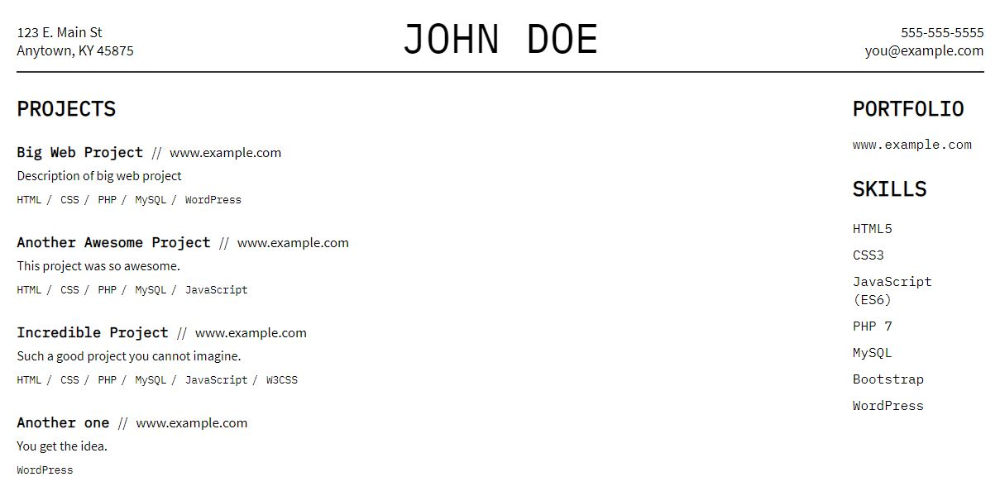

# Resume-the-Hard-Way

Takes a simple project-oriented resume in JSON format and lays it out on the page with DOM manipulation. This is me playing around and getting comfortable with Node.js, npm, webpack, Github, DOM manipulation, and whatever else occurs to me to try out here.

Responsive design features a two-column layout for larger screens and a one-column layout for small screens and print (or print-to-PDF). When working on your resume locally to print or save as PDF, an enableHideableNodes() function is available to hide projects or skills by clicking on them, rather than having to edit your resume JSON file for each job application.

My own resume is live [here](https://thischrisblack.github.io/Resume-the-Hard-Way/).

